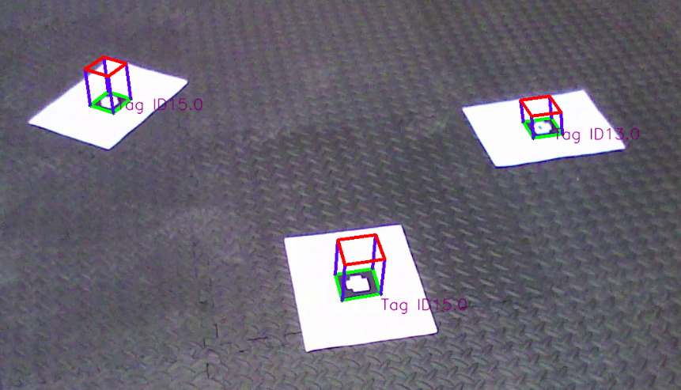

# Project 1- AR tag detection
## This project detects fudisal marker in the video and then place lena and cube photo on tracker. 

###### to run different files like lena and cube you just have to set respective flags to True and run the python file. 
###### To run lena image use the below runtag
- [x] python AR_Tag.py --video=Tag0 --lena_flag=True .
###### To run cube image use the below runtag
- [x] python AR_Tag.py --video=Tag0 --cube_flag=True

- The result is like below:

